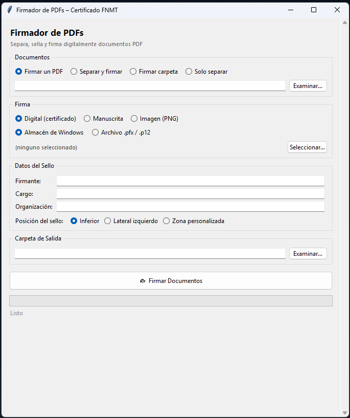

# FirmaPDF

Utilidad de escritorio para **separar un PDF multipágina en documentos individuales**, añadir un **sello visible** con los datos del firmante y **firmar digitalmente** cada página con certificado de la FNMT (u otro certificado PKCS#12).

Pensado para cualquier persona que necesite firmar documentos PDF de forma masiva con su certificado digital.




---

## Funcionalidades

- Separa un PDF de N páginas en N documentos individuales
- Añade un **sello visible** configurable: nombre del firmante, cargo, organización y fecha/hora
- Tres posiciones del sello:
  - **Inferior** — franja en la parte baja de cada página
  - **Lateral izquierdo** — franja vertical en el margen izquierdo
  - **Zona personalizada** — selección visual sobre la página, estilo Adobe, con texto en mayúsculas y tamaño adaptable
- **Nombre automático de archivos desde el PDF**:
  - **Seleccionar zona**: dibuja un rectángulo sobre la página y se extrae el texto de esa posición en cada página (útil para expedientes, DNIs, referencias, etc.)
  - **Buscar en frase**: escribe una frase del tipo *"acreditamos que {NOMBRE} ha asistido al curso"* y el programa extrae automáticamente lo que haya en `{NOMBRE}` de cada página, sin necesidad de seleccionar zona
  - Ambos métodos son combinables y muestran una **vista previa** en tiempo real del nombre resultante
  - Plantilla de nombre de archivo configurable (ej: `Certificado_{nombre}.pdf`)
- Firma digital con certificado FNMT directamente desde el **almacén de Windows** (como hace Chrome), sin necesidad de exportar la clave privada
- También soporta archivos **.pfx / .p12** exportados
- Interfaz gráfica sencilla (no requiere conocimientos técnicos)
- Empaquetable como un único `.exe` portable

---

## Instalación rápida (ejecutable)

Si solo quieres usar el programa sin instalar nada:

1. Ve a la sección [**Releases**](../../releases) de este repositorio
2. Descarga `FirmaPDF.exe`
3. Ejecuta con doble clic

> No necesitas instalar Python ni ninguna dependencia. El `.exe` es autocontenido.

---

## Instalación desde código fuente

### 1. Instalar Python

Si no tienes Python instalado:

1. Ve a [python.org/downloads](https://www.python.org/downloads/)
2. Descarga la última versión de **Python 3** (3.9 o superior)
3. Al instalar, **marca la casilla "Add Python to PATH"** (muy importante)
4. Pulsa "Install Now"

Para comprobar que se instaló correctamente, abre una terminal (tecla Windows, escribe `cmd`, Enter) y ejecuta:

```
python --version
```

Debería mostrar algo como `Python 3.12.x`.

### 2. Descargar el proyecto

Descarga o clona este repositorio:

```
git clone https://github.com/TU_USUARIO/firmapdf.git
cd firmapdf
```

O descarga el ZIP desde el botón verde "Code" > "Download ZIP" y descomprímelo.

### 3. Instalar dependencias

Abre una terminal en la carpeta del proyecto y ejecuta:

```
pip install -r requirements.txt
```

### 4. Ejecutar

```
python FirmaPDF.py
```

---

## Generar el ejecutable (.exe)

Si quieres generar tu propio `.exe` portable:

```
pip install pyinstaller
pyinstaller --onefile --windowed --noupx --name "FirmaPDF" FirmaPDF.py
```

El ejecutable se generará en la carpeta `dist/FirmaPDF.exe`.

---

## Uso

1. **Selecciona el PDF** multipágina que quieres separar y firmar
2. *(Opcional)* Marca **"Nombre de archivo desde el PDF"**:
   - Pulsa **"Seleccionar zona…"** para dibujar un área de donde extraer texto, o
   - Escribe una frase en **"Buscar en frase"** usando `{NOMBRE}` como comodín (ej: `acreditamos que {NOMBRE} ha asistido`)
   - Personaliza el **nombre de archivo** con una plantilla (ej: `Certificado_{nombre}`)
   - La vista previa te muestra al instante cómo quedará el nombre
3. **Elige el certificado**:
   - **Almacén de Windows** (recomendado): pulsa "Seleccionar..." y elige tu certificado FNMT del diálogo nativo de Windows
   - **Archivo .pfx / .p12**: selecciona el archivo e introduce la contraseña
4. **Rellena los datos del sello**: nombre del firmante, cargo y organización
5. **Elige la posición del sello**:
   - **Inferior** o **Lateral izquierdo** para posiciones predefinidas
   - **Zona personalizada** para dibujar sobre la página exactamente dónde colocar el sello (estilo Adobe)
6. **Selecciona la carpeta de salida**
7. Pulsa **"Firmar Documentos"**

Cada página del PDF original se guardará como un documento independiente, con el sello visible y la firma digital incorporada.

---

## Dependencias

| Librería | Función |
|----------|---------|
| [pypdf](https://pypi.org/project/pypdf/) | Separar y manipular páginas PDF |
| [reportlab](https://pypi.org/project/reportlab/) | Generar el sello visual como overlay |
| [pyhanko](https://pypi.org/project/pyHanko/) | Firma digital PAdES con certificado PKCS#12 |
| [PyMuPDF](https://pypi.org/project/PyMuPDF/) | Previsualización del PDF y extracción de texto por zona |

---

## Licencia

MIT
