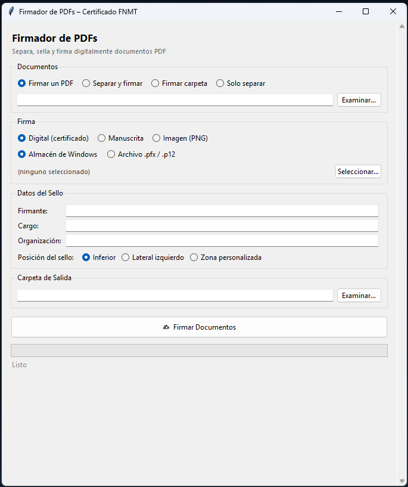

# FirmaPDF

Utilidad de escritorio para **separar, sellar y firmar documentos PDF** con certificado digital, firma manuscrita o imagen de firma.

Pensado para cualquier persona que necesite firmar documentos PDF de forma masiva: certificados de asistencia, actas, diplomas, expedientes, etc.




---

## Funcionalidades

- **Cuatro modos de trabajo**:
  - **Firmar un PDF** — sella y firma un PDF multipágina tal cual, sin cortarlo
  - **Separar y firmar** — divide un PDF en documentos individuales (configurable: cada 1, 2, 3… páginas), sella y firma cada uno
  - **Firmar carpeta** — sella y firma todos los PDFs de una carpeta de una vez
  - **Solo separar** — divide un PDF en documentos individuales sin sellar ni firmar (útil para preparar documentos antes de firmarlos)
- **Tres tipos de firma**:
  - **Digital (certificado)** — firma criptográfica con certificado FNMT u otro PKCS#12, con sello visible configurable
  - **Manuscrita** — dibuja tu firma a mano con el ratón directamente en la aplicación; trazo suavizado con interpolación Catmull-Rom y antialiasing por supersampling
  - **Imagen (PNG)** — coloca una imagen de tu firma (PNG, JPG, BMP) en la posición que elijas del documento
- **Sello visible** configurable (solo firma digital): nombre del firmante, cargo, organización y fecha/hora
- Tres posiciones del sello:
  - **Inferior** — franja en la parte baja de cada página
  - **Lateral izquierdo** — franja vertical en el margen izquierdo
  - **Zona personalizada** — selección visual sobre la página, estilo Adobe, con texto en mayúsculas y **tamaño de fuente auto-ajustable** al área seleccionada
- **Nombre automático de archivos desde el PDF**:
  - **Seleccionar zona**: dibuja un rectángulo sobre la página y se extrae el texto de esa posición en cada página (útil para expedientes, DNIs, referencias, etc.)
  - **OCR automático**: si el PDF es escaneado (imágenes), al seleccionar una zona se activa automáticamente el reconocimiento óptico de caracteres mediante la API OCR de Windows — sin instalar nada adicional (requiere Windows 10 o superior)
  - **Buscar en frase**: escribe una frase del tipo *"acreditamos que {NOMBRE} ha asistido al curso"* y el programa extrae automáticamente lo que haya en `{NOMBRE}` de cada página, sin necesidad de seleccionar zona
  - Ambos métodos son combinables y muestran una **vista previa** en tiempo real del nombre resultante
  - Plantilla de nombre de archivo configurable (ej: `Certificado_{nombre}.pdf`)
- Firma digital con certificado FNMT directamente desde el **almacén de Windows** (como hace Chrome), sin necesidad de exportar la clave privada
- También soporta archivos **.pfx / .p12** exportados
- Interfaz gráfica sencilla (no requiere conocimientos técnicos)
- Empaquetable como un único `.exe` portable

---

## Instalación rápida (ejecutable)

Si solo quieres usar el programa sin instalar nada:

1. Ve a la sección [**Releases**](../../releases) de este repositorio
2. Descarga `FirmaPDF.exe`
3. Ejecuta con doble clic

> No necesitas instalar Python ni ninguna dependencia. El `.exe` es autocontenido.

---

## Instalación desde código fuente

### 1. Instalar Python

Si no tienes Python instalado:

1. Ve a [python.org/downloads](https://www.python.org/downloads/)
2. Descarga la última versión de **Python 3** (3.9 o superior)
3. Al instalar, **marca la casilla "Add Python to PATH"** (muy importante)
4. Pulsa "Install Now"

Para comprobar que se instaló correctamente, abre una terminal (tecla Windows, escribe `cmd`, Enter) y ejecuta:

```
python --version
```

Debería mostrar algo como `Python 3.12.x`.

### 2. Descargar el proyecto

Descarga o clona este repositorio:

```
git clone https://github.com/TU_USUARIO/firmapdf.git
cd firmapdf
```

O descarga el ZIP desde el botón verde "Code" > "Download ZIP" y descomprímelo.

### 3. Instalar dependencias

Abre una terminal en la carpeta del proyecto y ejecuta:

```
pip install -r requirements.txt
```

### 4. Ejecutar

```
python FirmaPDF.py
```

---

## Generar el ejecutable (.exe)

Si quieres generar tu propio `.exe` portable:

```
pip install pyinstaller
pyinstaller --onefile --windowed --noupx --name "FirmaPDF" FirmaPDF.py
```

El ejecutable se generará en la carpeta `dist/FirmaPDF.exe`.

---

## Uso

1. **Elige el modo de trabajo**:
   - **Firmar un PDF**: selecciona un PDF y se firmará sin cortarlo
   - **Separar y firmar**: selecciona un PDF multipágina y elige cuántas páginas tendrá cada documento resultante
   - **Firmar carpeta**: selecciona una carpeta y se firmarán todos los PDFs que contenga
   - **Solo separar**: divide un PDF en documentos sin sellar ni firmar
2. *(Modos separar, carpeta y solo separar, opcional)* Marca **"Nombre de archivo desde el PDF"**:
   - Pulsa **"Seleccionar zona…"** para dibujar un área de donde extraer texto, o
   - Escribe una frase en **"Buscar en frase"** usando `{NOMBRE}` como comodín (ej: `acreditamos que {NOMBRE} ha asistido`)
   - Personaliza el **nombre de archivo** (ej: `Certificado_{nombre}`)
   - La vista previa te muestra al instante cómo quedará el nombre
3. **Elige el tipo de firma**:
   - **Digital (certificado)**: selecciona tu certificado del almacén de Windows o un archivo .pfx/.p12, rellena los datos del sello y elige su posición
   - **Manuscrita**: pulsa "Dibujar firma…", firma con el ratón en el lienzo que aparece, y selecciona la zona del documento donde colocarla
   - **Imagen (PNG)**: selecciona una imagen con tu firma y elige la zona del documento donde colocarla
4. **Selecciona la carpeta de salida**
5. Pulsa **"Firmar Documentos"** o **"Separar Documentos"** según el modo

---

## Dependencias

| Librería | Función |
|----------|---------|
| [pypdf](https://pypi.org/project/pypdf/) | Separar y manipular páginas PDF |
| [reportlab](https://pypi.org/project/reportlab/) | Generar el sello visual y overlay de firma como imagen |
| [pyhanko](https://pypi.org/project/pyHanko/) | Firma digital PAdES con certificado PKCS#12 |
| [PyMuPDF](https://pypi.org/project/PyMuPDF/) | Previsualización del PDF y extracción de texto por zona |
| [Pillow](https://pypi.org/project/Pillow/) | Procesamiento de imágenes: firma manuscrita, previews, antialiasing |
| [winocr](https://pypi.org/project/winocr/) | OCR de imágenes mediante Windows.Media.Ocr (requiere Windows 10+) |

---

## Novedades v1.5

- **Firma manuscrita**: dibuja tu firma con el ratón directamente en la aplicación, con trazo suavizado (Catmull-Rom + supersampling LANCZOS) y posicionamiento libre sobre el documento
- **Firma con imagen**: coloca un PNG/JPG con tu firma en cualquier zona del documento
- Interfaz reorganizada con selector de tipo de firma (Digital / Manuscrita / Imagen) — los datos del sello solo aparecen en firma digital
- Vista previa de la firma manuscrita/imagen en el panel principal

## Novedades v1.4

- **OCR automático**: detección de texto en PDFs escaneados mediante la API OCR de Windows (sin dependencias adicionales, requiere Windows 10+)
- Detección automática del idioma del sistema para el OCR

---

## Licencia

MIT
